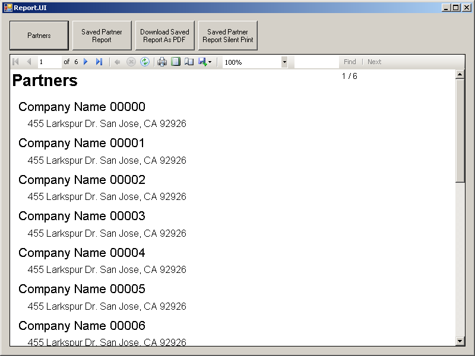

# .NET Reporting, server and client report solution #

## Reporting.Shared ##

	Contains all report model, rdlc files and logic for LocalReport initialization.

## Reporting.Server ##

	Simple WCF service as data provider and report generator.

## Reporting.UI ##

	Simple Window Forms application as report viewer and silent print solution.

## References ##
	<https://msdn.microsoft.com/en-us/library/ms252091.aspx>
	<https://msdn.microsoft.com/en-us/library/ms155373.aspx>

<http://robb83.github.io>